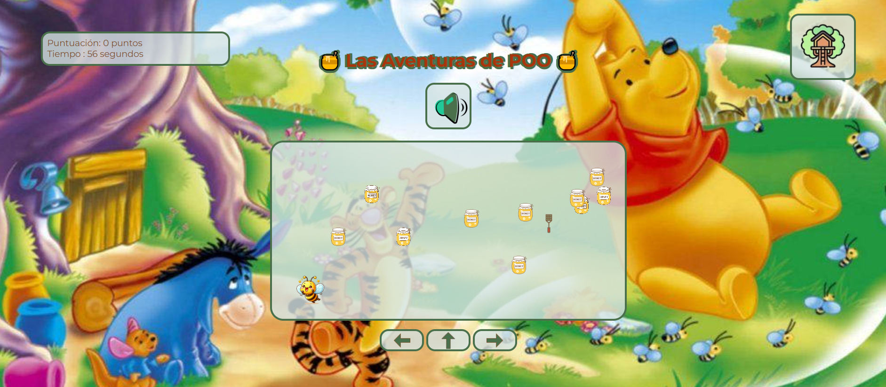

# Las Aventuras de POO🐝

📌 Descripción🐝

Este es un divertido juego donde controlamos una pequeña abejita cuya misión es recolectar toda la miel posible mientras evita un matamoscas. La mecánica del juego es sencilla y accesible para todos los públicos.

🎮 Cómo jugar

Haz clic en el botón Inicio  para comenzar la partida.

La abejita puede moverse en tres direcciones:

Izquierda

Derecha

Arriba (Saltar)

Puedes controlar a la abejita de dos formas:

Con el teclado: Usando las flechas direccionales.

Con el ratón: Pulsando los controles en pantalla.

El juego comienza con sonido activado, pero puedes apagarlo en cualquier momento.

🔧 Tecnologías utilizadas

JavaScript: Para la lógica del Juego

HTML Para aplicar la estructura de la interfaz

CSS Para los estilos y el diseño visual

🚀 Mejoras futuras

Este es solo el comienzo del juego, y planeamos agregar mejoras en futuras versiones, como:

Hacerlo responsive para que funcione en dispositivos móviles.

Incluir más obstáculos y aumentar la dificultad progresivamente.

Añadir nuevos niveles o mecánicas de juego para mayor variedad.

📷 Capturas de pantalla

💡 Créditos

Proyecto desarrollado con mucho esfuerzo y creatividad. ¡Esperamos que disfrutes jugando tanto como nosotros creándolo! 🎉🐝
