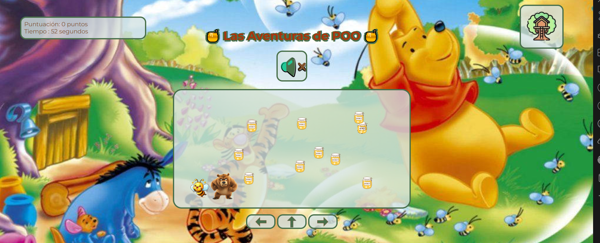

# Las Aventuras de POO 🐝



## 📌 Descripción

"Las Aventuras de POO" es un juego casual y entretenido donde controlas una abejita recolectora que debe conseguir la mayor cantidad de miel posible mientras esquiva el peligroso matamoscas. Con una mecánica simple pero adictiva, este juego está diseñado para ser disfrutado por jugadores de todas las edades.

## 🎮 Instrucciones de Juego

### Inicio

- Pulsa el botón de inicio  para comenzar la aventura

### Controles

El juego ofrece dos métodos de control para mayor accesibilidad:

**Teclado:**

- ⬅️ Flecha izquierda: Mover a la izquierda
- ➡️ Flecha derecha: Mover a la derecha
- ⬆️ Flecha arriba: Saltar

**Ratón:**

- Interfaz táctil en pantalla con botones direccionales

### Características

- Sistema de puntuación basado en la recolección de miel
- Control de audio ajustable durante el juego
- Diseño intuitivo y amigable

## 🛠️ Tecnologías

- **Frontend:**
  - HTML5
  - CSS3
  - JavaScript vanilla

## 🚀 Roadmap

El proyecto está en continuo desarrollo con las siguientes mejoras planificadas:

1. **Fase 1: Optimización**
   - Implementación de diseño responsive
   - Adaptación para dispositivos móviles

2. **Fase 2: Contenido**
   - Nuevos niveles con dificultad progresiva
   - Sistema de obstáculos variados
   - Mecánicas de juego adicionales

3. **Fase 3: Experiencia de Usuario**
   - Sistema de logros
   - Tabla de puntuaciones
   - Modos de juego adicionales

## 👾 Demo

[Enlace al juego] *(Añadir enlace cuando esté disponible)*

## 💻 Instalación

```bash
# Clonar el repositorio
git clone [https://github.com/Noemi1977/juego-poo.git]

# Abrir el juego
Abre index.html en tu navegador preferido
```

## 🤝 Contribuciones

Las sugerencias y contribuciones son siempre bienvenidas.
Puedes:

1. Fork este repositorio
2. Crear una nueva rama (`git checkout -b feature/mejora`)
3. Realizar tus cambios
4. Commit (`git commit -m 'Añade nueva funcionalidad'`)
5. Push a la rama (`git push origin feature/mejora`)
6. Abrir un Pull Request

## ✨ Autora

Noemi Casaprima - Desarrolladora Full Stack

- [GitHub] *([(https://github.com/Noemi1977)])*

- [LinkedIn] *([https://www.linkedin.com/in/
noemí-casaprima-pendás]
)*

## 📝 Licencia

Este proyecto es open source

---

Desarrollado con 💖 y ☕ como parte del bootcamp de Factoria F5.
